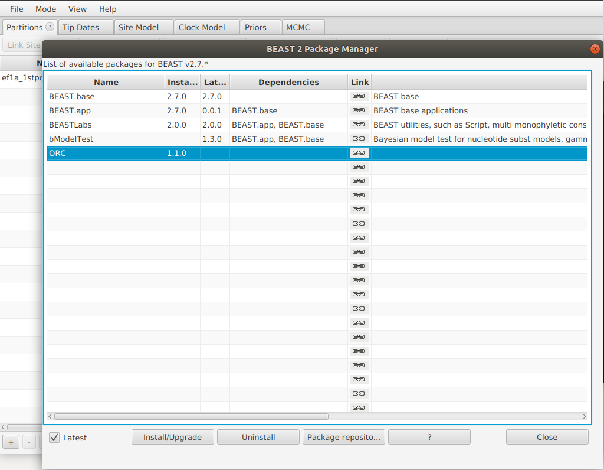
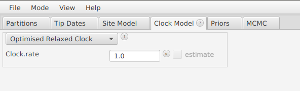
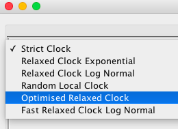
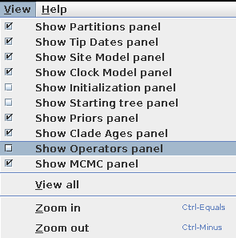
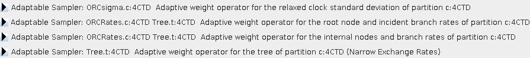

# ORC - Optimised Relaxed Clock


A BEAST 2 package containing a series of optimisations made to improve the performance of the phylogenetic relaxed clock model. 
Depending on the dataset, the methods presented here can yield relaxed clock model mixing up to 65 times faster than the standard BEAST 2 relaxed clock model setup.
The gap widens as the alignment becomes longer making this package very effective at doing inference on long alignments.


## Installation instructions

Both installation pathways assume you have BEAST 2 already installed on your machine https://www.beast2.org/


### BEAUti


1. Launch BEAUti
2. Click on File -> Manage Packages




3. Install ORC

If ORC is not in the list of packages, you may need to add an extra package repository as follows:

* click the `packager repositories` button. A dialog pops up.
* click the `Add URL` button. A dialog is shown where you can enter `https://raw.githubusercontent.com/CompEvol/CBAN/master/packages-extra.xml`
* click the `OK` button. There should be an extra entry in the list.
* click `Done`
* After a short delay, the ORC package should appear in the list of packages.




4. Import an alignment and set up the model as per usual

5. On the Clock Model tab, select 'Optimised Relaxed Clock' from the dropdown menu




6. To confirm this has worked, display the Operators tab as shown below



7. You should see the following 4 adaptive operators in the Operators tab:



8. File -> Save As and run the .xml file using BEAST 2 as per usual


### By hand


To install this package manually, first clone this repository and all of its dependencies from GitHub, including BEAST 2

```
mkdir beast2
cd beast2
git clone https://github.com/CompEvol/BEAST2
git clone https://github.com/BEAST2-Dev/BEASTLabs
git clone https://github.com/Rong419/ConstantDistanceOperator
git clone https://github.com/jordandouglas/ORC
```

Then navigate to into each directory and install them using ant

```
cd BEAST2
ant linux

cd ../BEASTLabs
ant addon

cd ../ConstantDistanceOperator
ant addon

cd ../ORC
ant addon

cd ../
```

Finally, extract the contents of these addons:

```
unzip -o BEASTLabs/build/dist/ORC.addon.v*zip -d ~/.beast/2.6/BEASTLabs/.
unzip -o ConstantDistanceOperator/build/dist/ORC.addon.v*zip -d ~/.beast/2.6/FastRelaxedClockLogNormal/.
unzip -o ORC/build/dist/ORC.addon.v*zip -d ~/.beast/2.6/ORC/.
```


This assumes that BEAST 2 is installed in the ~/.BEAST 2/ directory.

If you are not using BEAST 2.6 then replace 2.6 with the appropriate version number.
For more details see https://beast2.blogs.auckland.ac.nz/managing-packages/#Install_by_hand .


## Automated generation of Narrow Exchange Rate operators
Run matlab/GenerateOperators.m using MATLAB to generate all 47 solvable operators with non-zero Jacobians from the complete set of 63 (excluding narrow exchange)


